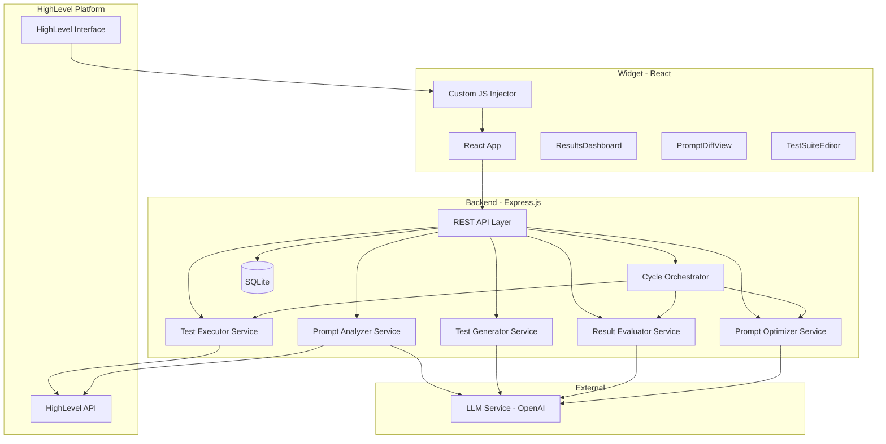
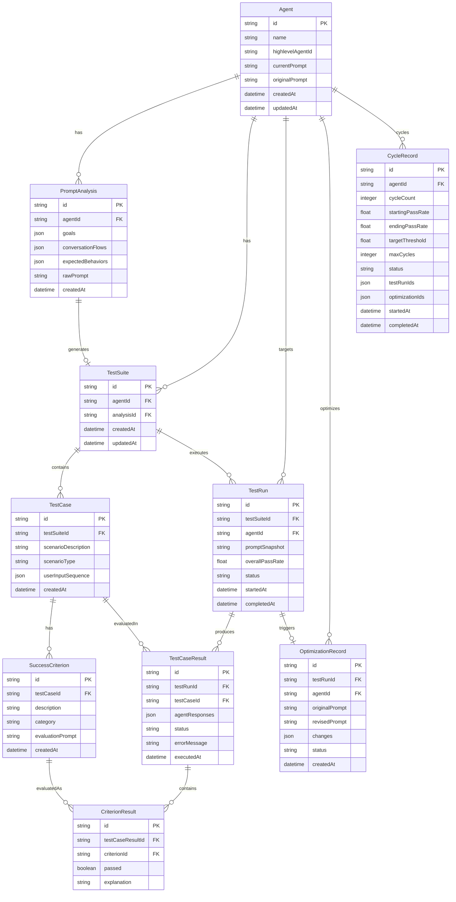

# Design Document: Voice AI Performance Optimizer

## Overview

The Voice AI Performance Optimizer is a full-stack application with a React frontend widget embedded in the HighLevel interface and an Express.js backend API. The system implements a "Validation Flywheel" — an automated loop that analyzes Voice AI agent prompts, generates test cases with success criteria, executes tests, evaluates results, and refines prompts using an LLM.

The frontend is a React 18+ app (TypeScript, functional components, hooks) that handles user interaction and visualization. The backend is Express.js (TypeScript) orchestrating the test-optimize pipeline. An LLM service abstraction handles all AI-driven tasks. Communication uses REST, with SSE for real-time cycle progress. SQLite stores all persistent state.

## Architecture



### Key Architectural Decisions

1. **REST API over WebSocket**: REST is sufficient for the request-response pattern. For real-time cycle progress, we use Server-Sent Events (SSE) on a single endpoint rather than full WebSocket complexity.

2. **SQLite for persistence**: Lightweight, file-based storage. No separate database server needed. Stores test suites, test runs, optimization history, and prompt versions.

3. **LLM Service Abstraction**: All LLM calls go through a single service layer with structured prompt templates. Easy to swap providers (OpenAI, Anthropic, etc.) with consistent error handling and retry logic.

4. **Stateless Backend Services**: Each service (analyzer, generator, executor, evaluator, optimizer) is stateless. All state lives in SQLite. Simplifies testing and reasoning.

5. **React with functional components and hooks**: Simple, well-understood patterns. No state management library needed — React's built-in `useState` and `useEffect` plus a thin API client are sufficient for this scope.

## Components and Interfaces

### Frontend Components (React + TypeScript)

#### Widget Injector (`widget-injector.js`)
- Standalone JS file loaded via HighLevel custom code injection
- Creates a shadow DOM container to isolate the React app from HighLevel styles
- Passes HighLevel session context (auth token, location ID) to the React app via props

#### React Components

| Component | Responsibility |
|---|---|
| `App` | Main layout with tab navigation: Analyze → Test → Optimize → Dashboard |
| `AgentSelector` | Lists available Voice AI agents, allows user to pick one for optimization |
| `PromptAnalysisView` | Displays structured analysis of the agent's prompt (goals, flows, behaviors) |
| `TestSuiteEditor` | CRUD interface for test cases and success criteria |
| `TestRunView` | Shows test execution progress and individual test case results |
| `ResultsDashboard` | Displays overall pass rate, per-criterion results, trend across runs |
| `PromptDiffView` | Side-by-side diff of original vs. revised prompt with accept/reject/edit controls |
| `BeforeAfterView` | Comparison of metrics and prompts before and after optimization |
| `CycleControlPanel` | Controls for auto-cycle mode: threshold, start/pause/cancel, real-time status |

#### API Client (`api.ts`)
- Single module exporting functions for each backend endpoint
- Uses `fetch` — no external HTTP library needed
- Handles error responses consistently, returns typed results

### Backend Services (Express.js + TypeScript)

#### REST API Layer (`/api`)

| Endpoint | Method | Description |
|---|---|---|
| `/api/agents` | GET | List available Voice AI agents |
| `/api/agents/:id/prompt` | GET | Retrieve agent's base prompt |
| `/api/agents/:id/prompt` | PUT | Update agent's base prompt |
| `/api/analysis` | POST | Trigger prompt analysis for an agent |
| `/api/test-suites` | POST | Create a new test suite (generates test cases + criteria) |
| `/api/test-suites/:id` | GET | Retrieve a test suite |
| `/api/test-suites/:id` | PUT | Update test cases / criteria |
| `/api/test-runs` | POST | Execute a test run |
| `/api/test-runs/:id` | GET | Get test run results |
| `/api/test-runs/:id/retry/:caseId` | POST | Retry a single failed test case |
| `/api/optimize` | POST | Generate optimized prompt from test run results |
| `/api/optimize/:id/apply` | POST | Apply optimized prompt to agent |
| `/api/cycles` | POST | Start an auto-optimization cycle |
| `/api/cycles/:id` | GET | Get cycle status |
| `/api/cycles/:id/cancel` | POST | Cancel a running cycle |
| `/api/cycles/:id/events` | GET (SSE) | Stream real-time cycle progress events |
| `/api/agents/:id/comparison` | GET | Get before/after comparison data |

#### Prompt Analyzer Service

```typescript
interface PromptAnalysis {
  agentId: string;
  goals: string[];
  conversationFlows: ConversationFlow[];
  expectedBehaviors: ExpectedBehavior[];
  rawPrompt: string;
}

interface ConversationFlow {
  name: string;
  description: string;
  steps: string[];
}

interface ExpectedBehavior {
  description: string;
  category: 'behavioral' | 'functional' | 'compliance';
}
```

- Receives a raw Base Prompt string
- Sends a structured LLM prompt requesting extraction of goals, flows, and behaviors
- Parses the LLM response into a `PromptAnalysis` object
- Stores analysis in SQLite

#### Test Generator Service

```typescript
interface TestCase {
  id: string;
  scenarioDescription: string;
  scenarioType: 'happy-path' | 'adversarial';
  userInputSequence: UserInput[];
  successCriteria: SuccessCriterion[];
}

interface UserInput {
  turn: number;
  utterance: string;
  context?: string;
}

interface SuccessCriterion {
  id: string;
  description: string;
  category: 'behavioral' | 'functional' | 'compliance';
  evaluationPrompt: string;
}
```

- Receives a `PromptAnalysis` object
- Generates test cases covering each identified goal and flow
- Ensures mix of happy-path and adversarial scenarios
- Generates at least 5 test cases, each with at least one success criterion

#### Test Executor Service

```typescript
interface TestCaseResult {
  testCaseId: string;
  agentResponses: AgentResponse[];
  criterionResults: CriterionResult[];
  status: 'completed' | 'error';
  errorMessage?: string;
}

interface AgentResponse {
  turn: number;
  utterance: string;
}

interface CriterionResult {
  criterionId: string;
  passed: boolean;
  explanation: string;
}
```

- Simulates conversation by sending each `UserInput` to the Voice AI agent via HighLevel API
- Captures agent responses, passes to Result Evaluator
- Handles timeouts and API errors, marking status as 'error'

#### Result Evaluator Service

- For each criterion, constructs an LLM evaluation prompt using the criterion's `evaluationPrompt` and the actual agent response
- Returns structured pass/fail judgment with explanation
- Calculates overall pass rate across all criteria in a test run

#### Prompt Optimizer Service

```typescript
interface OptimizationResult {
  originalPrompt: string;
  revisedPrompt: string;
  changes: PromptChange[];
  targetedFailures: string[];
}

interface PromptChange {
  description: string;
  rationale: string;
}
```

- Takes original prompt, test results with failures, and passing criteria
- LLM generates revised prompt targeting failures while preserving successes
- Returns original and revised prompts with list of changes

#### Cycle Orchestrator

- Manages the auto-cycle loop: test → evaluate → optimize → repeat
- Tracks cycle count, current pass rate, user-defined threshold
- Emits SSE events for real-time progress
- Supports pause and cancel via state flag
- Stops when pass rate meets threshold or max cycles reached

### LLM Service Layer

```typescript
interface LLMService {
  analyzePrompt(prompt: string): Promise<PromptAnalysis>;
  generateTestCases(analysis: PromptAnalysis): Promise<TestCase[]>;
  evaluateCriterion(response: string, criterion: SuccessCriterion): Promise<CriterionResult>;
  optimizePrompt(original: string, failures: CriterionResult[], passes: CriterionResult[]): Promise<OptimizationResult>;
}
```

- Wraps all LLM API calls with retry logic, timeout, and error handling
- Uses structured prompt templates stored as constants
- Parses LLM responses using JSON mode where available
- Configurable provider (defaults to OpenAI GPT-4)

## Data Models

### Database Schema (SQLite)



### Key Data Invariants

- Every `TestCase` has at least one `SuccessCriterion`
- Every `TestSuite` has at least 5 `TestCase` entries
- `TestRun.overallPassRate` equals passed `CriterionResult` count divided by total (excluding errors)
- `TestCaseResult.status` is 'completed' or 'error'; errors excluded from pass rate
- `CycleRecord.status` is one of: 'running', 'paused', 'completed', 'cancelled'
- `Agent.originalPrompt` is set once on first analysis and never modified
- `OptimizationRecord.status` is one of: 'generated', 'accepted', 'rejected'


## Correctness Properties

*A property is a characteristic or behavior that should hold true across all valid executions of a system — essentially, a formal statement about what the system should do. Properties serve as the bridge between human-readable specifications and machine-verifiable correctness guarantees.*

### Property 1: Prompt analysis produces valid structured output

*For any* valid Base Prompt string, the Prompt Analyzer Service SHALL produce a PromptAnalysis object containing a non-empty `goals` array, a non-empty `conversationFlows` array, and a non-empty `expectedBehaviors` array, where each behavior has a valid category.

**Validates: Requirements 1.2, 1.3**

### Property 2: Generated test cases cover identified goals and flows

*For any* PromptAnalysis with N goals and M conversation flows, the generated Test Cases SHALL collectively reference every goal and every conversation flow from the analysis at least once.

**Validates: Requirements 2.1**

### Property 3: Generated test suite contains both scenario types

*For any* generated set of Test Cases, there SHALL be at least one Test Case with `scenarioType` equal to `'happy-path'` and at least one with `scenarioType` equal to `'adversarial'`.

**Validates: Requirements 2.2**

### Property 4: Generated test suite structural validity

*For any* generated Test Suite, the suite SHALL contain at least 5 Test Cases, each Test Case SHALL have a non-empty `userInputSequence` and a non-empty `scenarioDescription`, each Test Case SHALL have at least one SuccessCriterion, and each SuccessCriterion SHALL have a `category` value that is one of `'behavioral'`, `'functional'`, or `'compliance'`.

**Validates: Requirements 2.3, 2.4, 3.1, 3.4**

### Property 5: Test suite CRUD operations preserve data integrity

*For any* Test Suite, adding a Test Case SHALL increase the test case count by one and the added case SHALL be retrievable by its ID; removing a Test Case SHALL decrease the count by one and the case SHALL no longer be retrievable; editing a Test Case SHALL preserve its ID while updating its content. The same holds for Success Criteria within a Test Case.

**Validates: Requirements 2.5, 3.3**

### Property 6: Test execution produces complete results

*For any* Test Run against a Test Suite, there SHALL be exactly one TestCaseResult for every TestCase in the suite. For each TestCaseResult with status `'completed'`, the `agentResponses` array SHALL have a length equal to the `userInputSequence` length of the corresponding TestCase, and there SHALL be exactly one CriterionResult for every SuccessCriterion associated with that TestCase.

**Validates: Requirements 4.1, 4.2, 4.3**

### Property 7: Pass rate calculation correctness

*For any* completed Test Run, the `overallPassRate` SHALL equal the number of CriterionResults with `passed === true` divided by the total number of CriterionResults (excluding those from TestCaseResults with status `'error'`). When all TestCaseResults have status `'error'`, the pass rate SHALL be 0.

**Validates: Requirements 4.4**

### Property 8: Failed criterion results include explanations

*For any* CriterionResult where `passed` is `false`, the `explanation` field SHALL be a non-empty string.

**Validates: Requirements 5.3**

### Property 9: Dashboard renders all test run data

*For any* completed Test Run, the rendered dashboard data SHALL include the overall pass rate, a result entry for every TestCase, a criterion result for every SuccessCriterion, and the agent's actual response text alongside each criterion evaluation.

**Validates: Requirements 5.1, 5.2**

### Property 10: Comparison view contains complete before/after data

*For any* agent with at least one completed Optimization Cycle, the comparison data SHALL include the original Base Prompt, the current optimized Base Prompt, test result metrics for both states, a list of improvements (criteria that changed from fail to pass), and a list of regressions (criteria that changed from pass to fail). When multiple Test Runs exist, the comparison data SHALL include all runs ordered chronologically.

**Validates: Requirements 5.4, 9.1, 9.2, 9.3**

### Property 11: Optimization produces a different revised prompt

*For any* Test Run with at least one failed criterion, the Prompt Optimizer Service SHALL produce an OptimizationResult where `revisedPrompt` is not equal to `originalPrompt` and `targetedFailures` is a non-empty array referencing the failed criterion IDs.

**Validates: Requirements 6.1**

### Property 12: Diff computation correctness

*For any* two distinct strings A and B, the diff function SHALL produce a non-empty list of changes. For any two identical strings, the diff function SHALL produce an empty list of changes.

**Validates: Requirements 6.3**

### Property 13: Optimization record status transitions

*For any* OptimizationRecord, the status SHALL only transition through valid paths: `'generated'` → `'accepted'` or `'generated'` → `'rejected'`. No other transitions SHALL be permitted.

**Validates: Requirements 6.4**

### Property 14: Auto-cycle termination conditions

*For any* auto-cycle configuration with a target threshold T and maximum cycle count M, the Cycle Orchestrator SHALL terminate when either the overall pass rate >= T or the cycle count >= M, whichever occurs first. The cycle SHALL never execute more than M iterations.

**Validates: Requirements 7.1**

### Property 15: Cycle records contain complete data

*For any* CycleRecord, it SHALL contain a valid `cycleCount` >= 0, `startingPassRate` and `endingPassRate` between 0 and 1 inclusive, a `status` that is one of `'running'`, `'paused'`, `'completed'`, or `'cancelled'`, and arrays of `testRunIds` and `optimizationIds` with lengths consistent with the cycle count.

**Validates: Requirements 7.2, 7.3**

### Property 16: Cycle state transitions are valid

*For any* CycleRecord, the status SHALL only transition through valid paths: `'running'` → `'paused'`, `'running'` → `'cancelled'`, `'running'` → `'completed'`, `'paused'` → `'running'`, `'paused'` → `'cancelled'`. No other transitions SHALL be permitted.

**Validates: Requirements 7.4**

### Property 17: Widget state round-trip persistence

*For any* valid widget state object, serializing the state to storage and then deserializing it SHALL produce an object equivalent to the original state.

**Validates: Requirements 8.4**

## Error Handling

### API Error Handling (HighLevel API)

| Error Scenario | Handling Strategy |
|---|---|
| HighLevel API unreachable | Return descriptive error with retry option. Cache last known agent data locally. (Req 1.4) |
| HighLevel API auth failure | Prompt user to re-authenticate. Display clear auth error message. |
| Agent prompt update failure | Retain revised prompt in SQLite. Display error with retry button. (Req 6.6) |
| Rate limiting | Exponential backoff with max 3 retries. Display wait message. |

### LLM Service Error Handling

| Error Scenario | Handling Strategy |
|---|---|
| LLM API timeout | Retry up to 3 times with exponential backoff. If all fail, return error with retry option. |
| Malformed JSON response | Attempt lenient parse. If still invalid, retry with stricter prompt. After 2 failures, return error. |
| Incomplete analysis | Validate against expected schema. If fields missing, retry with explicit field requirements. |
| Rate limit exceeded | Queue requests with delay. Display progress indicator. |

### Test Execution Error Handling

| Error Scenario | Handling Strategy |
|---|---|
| Test case timeout | Mark status as `'error'` with message. Exclude from pass rate. Allow retry. (Req 4.5) |
| Agent unresponsive | Mark as `'error'`. Continue remaining test cases. Report partial results. |
| All test cases error | Display aggregate error summary. Suggest checking agent config and API connectivity. |

### General Error Patterns

- All API endpoints return structured errors: `{ error: { code: string, message: string, retryable: boolean } }`
- Frontend displays errors in a non-blocking toast notification
- Transient errors auto-retried; permanent errors surface immediately
- All errors logged with context for debugging

## Testing Strategy

### Testing Framework

- **Unit & Integration Tests**: Vitest (fast, ESM-native, works for both Node.js backend and React frontend)
- **Property-Based Tests**: fast-check (TypeScript PBT library, integrates with Vitest)
- **Component Tests**: React Testing Library + Vitest for React component testing
- **API Tests**: Supertest for HTTP endpoint testing

### Unit Tests

Unit tests cover specific examples, edge cases, and error conditions:

- **Prompt Analyzer**: Test with known prompts, verify extracted goals/flows match expected output
- **Test Generator**: Test with known analyses, verify generated test cases meet structural requirements
- **Result Evaluator**: Test pass/fail scoring with known agent responses and criteria
- **Pass Rate Calculator**: Test edge cases (all pass, all fail, all error, mixed)
- **Diff Engine**: Test with identical strings, completely different strings, single character changes
- **State Machine**: Test all valid and invalid state transitions for OptimizationRecord and CycleRecord
- **Error Handling**: Test each error scenario returns correct error structure

### Property-Based Tests

Property tests validate universal correctness properties using fast-check. Each property test runs a minimum of 100 iterations.

| Property | Test Description | Tag |
|---|---|---|
| Property 1 | Generate random prompt strings, run through analyzer, verify output structure | Feature: voice-ai-performance-optimizer, Property 1: Prompt analysis produces valid structured output |
| Property 2 | Generate random PromptAnalysis objects, verify goal/flow coverage | Feature: voice-ai-performance-optimizer, Property 2: Generated test cases cover identified goals and flows |
| Property 3 | Generate random PromptAnalysis objects, verify scenario type mix | Feature: voice-ai-performance-optimizer, Property 3: Generated test suite contains both scenario types |
| Property 4 | Generate random PromptAnalysis objects, verify structural invariants | Feature: voice-ai-performance-optimizer, Property 4: Generated test suite structural validity |
| Property 5 | Generate random CRUD operations on test suites, verify count and retrievability | Feature: voice-ai-performance-optimizer, Property 5: Test suite CRUD operations preserve data integrity |
| Property 6 | Generate random test suites and mock results, verify completeness | Feature: voice-ai-performance-optimizer, Property 6: Test execution produces complete results |
| Property 7 | Generate random CriterionResults, compute pass rate, verify formula | Feature: voice-ai-performance-optimizer, Property 7: Pass rate calculation correctness |
| Property 8 | Generate random CriterionResults with passed=false, verify explanation non-empty | Feature: voice-ai-performance-optimizer, Property 8: Failed criterion results include explanations |
| Property 9 | Generate random TestRun data, render dashboard, verify all data present | Feature: voice-ai-performance-optimizer, Property 9: Dashboard renders all test run data |
| Property 10 | Generate random before/after data, verify comparison completeness | Feature: voice-ai-performance-optimizer, Property 10: Comparison view contains complete before/after data |
| Property 11 | Generate random test runs with failures, verify output differs from input | Feature: voice-ai-performance-optimizer, Property 11: Optimization produces a different revised prompt |
| Property 12 | Generate random string pairs, verify diff non-empty for distinct, empty for identical | Feature: voice-ai-performance-optimizer, Property 12: Diff computation correctness |
| Property 13 | Generate random status transitions, verify only valid paths succeed | Feature: voice-ai-performance-optimizer, Property 13: Optimization record status transitions |
| Property 14 | Generate random cycle configs, simulate cycles, verify termination | Feature: voice-ai-performance-optimizer, Property 14: Auto-cycle termination conditions |
| Property 15 | Generate random CycleRecords, verify all required fields valid | Feature: voice-ai-performance-optimizer, Property 15: Cycle records contain complete data |
| Property 16 | Generate random cycle state transitions, verify only valid paths succeed | Feature: voice-ai-performance-optimizer, Property 16: Cycle state transitions are valid |
| Property 17 | Generate random widget state objects, serialize then deserialize, verify equivalence | Feature: voice-ai-performance-optimizer, Property 17: Widget state round-trip persistence |

### Integration Tests

- **API Endpoint Tests**: Test each REST endpoint with Supertest
- **HighLevel API Mock**: Mock HighLevel API to test integration logic without live sandbox
- **LLM Service Mock**: Mock LLM responses to test full pipeline deterministically
- **End-to-End Pipeline**: Test full analyze → generate → execute → evaluate → optimize flow with mocked externals

### Test Organization

```
backend/
  tests/
    unit/
      services/
        prompt-analyzer.test.ts
        test-generator.test.ts
        test-executor.test.ts
        result-evaluator.test.ts
        prompt-optimizer.test.ts
        cycle-orchestrator.test.ts
        llm-service.test.ts
      utils/
        pass-rate.test.ts
        diff.test.ts
        state-machine.test.ts
      database.test.ts
    property/
      prompt-analysis.property.test.ts
      test-generation.property.test.ts
      test-execution.property.test.ts
      pass-rate.property.test.ts
      optimization.property.test.ts
      cycle.property.test.ts
      diff.property.test.ts
      state-machine.property.test.ts
      dashboard.property.test.ts
      comparison.property.test.ts
    integration/
      agents.test.ts
      test-suites.test.ts
      test-runs.test.ts
      optimize.test.ts
      cycles.test.ts
      full-cycle.test.ts
frontend/
  src/
    __tests__/
      components/
        AgentSelector.test.tsx
        TestSuiteEditor.test.tsx
        ResultsDashboard.test.tsx
        PromptDiffView.test.tsx
      widget-state.property.test.ts
```
